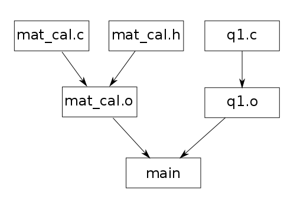

# b4school Makefile  
詳しくは[b4スクール資料](http://karafuto/b4school/network.pdf)を参照してください．[^mk]  
[^mk]:ちなみにこのファイルは**Markdown**という記法で書かれています．覚えておくと便利なので是非調べて見てください．ブラウザの拡張機能を入れれば簡単に見れます．

## ファイルの依存関係  
依存関係は以下の通り．  

  
